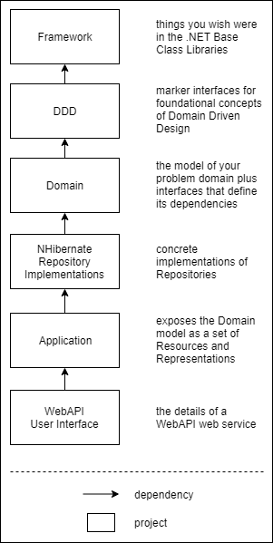

<!-- 
diagram source: https://drive.google.com/file/d/1YGiO0Z_0-VR1vuAwUtS0di-N9PVg1sZA/view?usp=sharing
-->

This is a "scale model" project to explore what [Domain Driven Design](https://en.wikipedia.org/wiki/Domain-driven_design) can look like in the presence of some pre-existing technology decisions:

- [StructureMap](http://structuremap.github.io/) for dependency inversion
- [Fluent](http://www.fluentnhibernate.org/) [NHibernate](http://nhibernate.info/) as an ORM
- [Microsoft SQL Server](https://www.microsoft.com/en-us/sql-server/) as the principle data store
- [ASP.NET WebAPI](https://www.asp.net/web-api) for web services

Project directories (either do or will) contain further detail.
